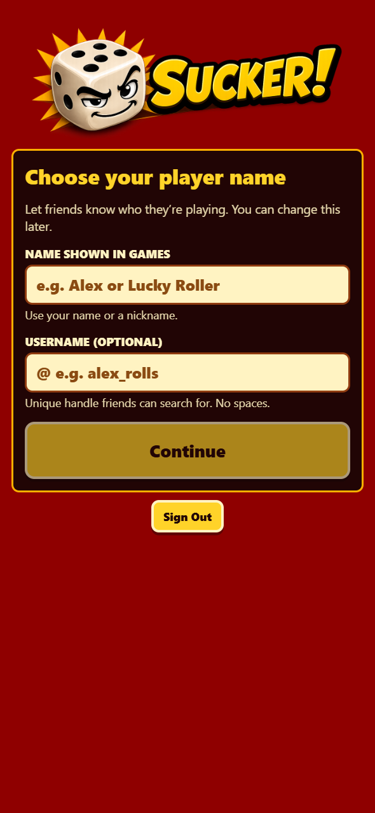

# Apple sign-in and player setup

Apple sign-in and explicit account linking are available only in the native iOS app. New Apple accounts choose a public player name before entering the lobby; username is optional. Existing and linked accounts retain their profiles. Profile uses clearer name labels and a compact button leading to a dedicated password page.

The preview below shows the actual setup screen in the collaborative browser at a 393 × 852 viewport with mocked Apple authentication. It does not verify Apple's native sign-in sheet.

Validation after merging main `c34b50a`:

- Both app and Edge typechecks passed; 160 app tests and 20 Edge tests passed.
- The migration and SQL assertions passed against a disposable PostgreSQL database, including existing-account preservation, new Apple accounts, optional usernames, conflict rollback, and atomic setup completion.
- Browser checks covered blank and whitespace names, username conflicts with retained drafts, retry without a username, resumed unfinished setup, and completed accounts returning to the lobby.
- Chromium and mobile WebKit regression cases are included for CI; they were not run through the standalone runner locally.

Before release, apply the database migration, configure Apple and hosted Supabase, and verify real sign-in and account linking on a signed iPhone build. See [the setup and verification instructions](../../apple-sign-in.md).
