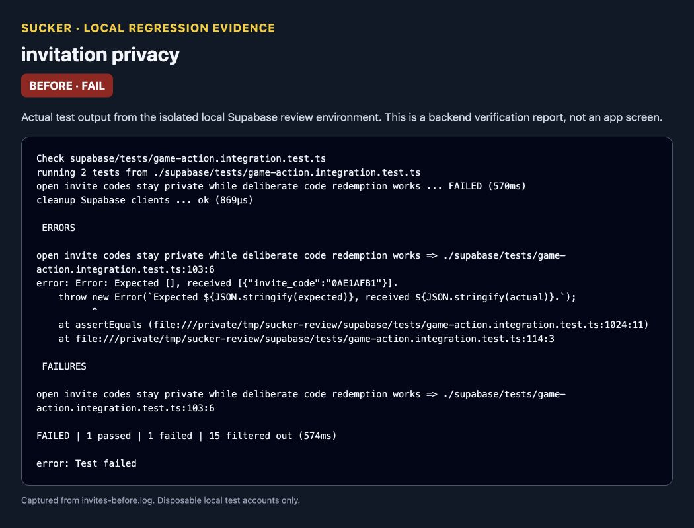
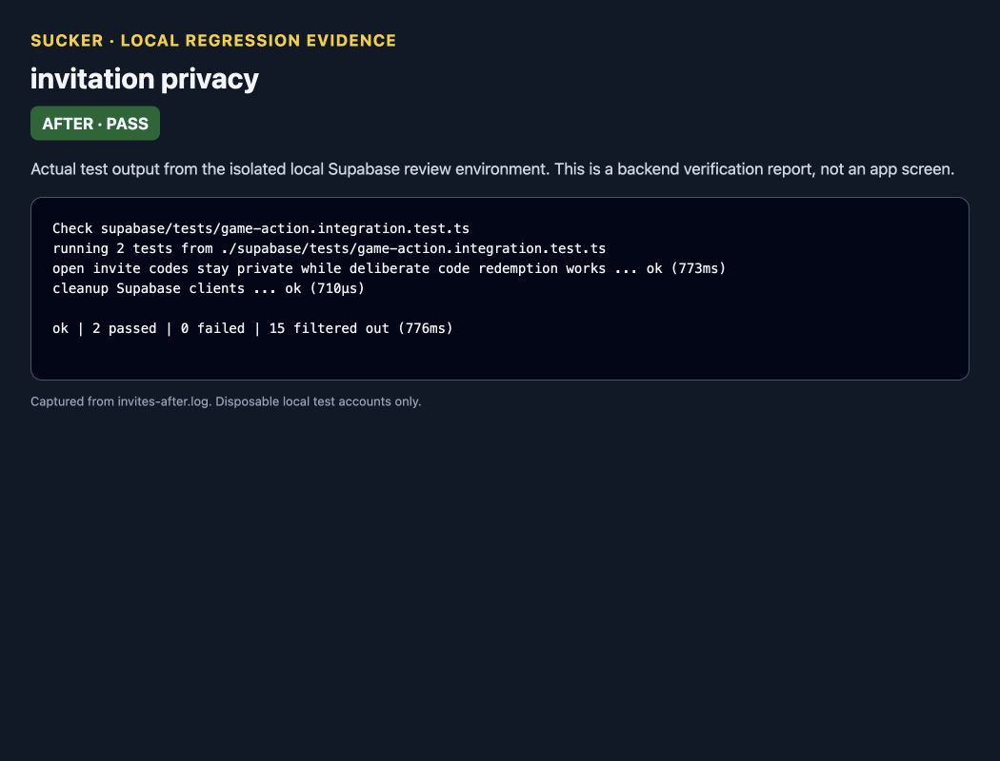

# Invitation privacy verification

The screenshots show actual regression-test output from a dedicated local Supabase instance, using disposable accounts.

Before the migration, an unrelated account could read an open invitation's code. The test failed with `Expected [], received [{"invite_code":...}]`. After the migration, the same test passes and also verifies that the owner and named recipient retain access, while deliberate code redemption still works.

Baseline: `715c7ec`, with the regression test added before changing the policy.

```sh
deno test --env-file=supabase/.temp/e2e.env --allow-env --allow-net \
  --filter '/open invite codes|cleanup Supabase clients/' \
  supabase/tests/game-action.integration.test.ts
```





The report screenshots visualize the test logs; they are not screenshots of an app interface. The database migration is the only runtime behavior change.
