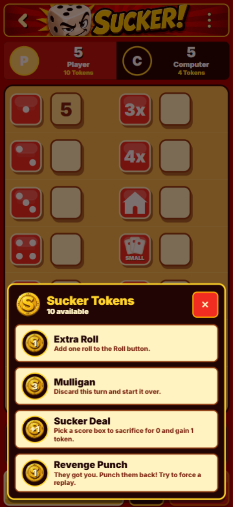
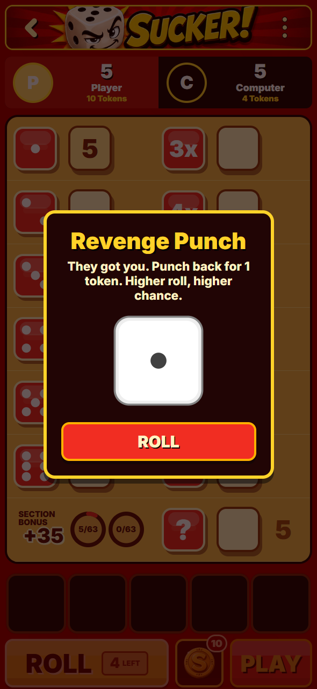

# Revenge Punch

Each landed punch received reduces the victim's next punch price from 3 to 2 to 1 token. The banked discount survives turns and reloads until a punch is thrown. A counterpunch uses the cheaper price and never combines discounts.

Checked the local app in the collaborative browser at 393 × 852. After two hits, the menu and chance dialog show a 1-token Revenge Punch. The menu says “They got you. Punch them back! Try to force a replay.” Players discover the discount through the name and displayed price. Preparing and reloading preserves the discount; throwing a missed punch spends one token, clears revenge, and returns the menu to the regular 3-token price. The document remains 852 pixels tall with no vertical scrolling.

| Token menu after two hits                    | Chance dialog                                      |
| -------------------------------------------- | -------------------------------------------------- |
|  |  |

Regression tests cover the 2-token and 1-token prices, repeated hits, hit/miss consumption, save/reload, counterpunch interaction, completion, computer play, multiplayer retries, and actual token accounting.
