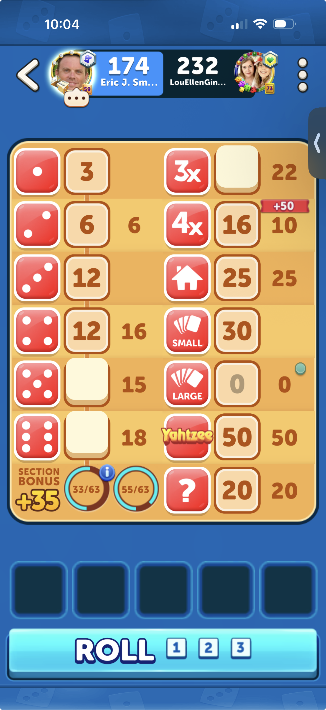

# Sucker! UI Reference

The scorecard and dice tray should be worked toward this screenshot:

The dice hold/unhold interaction should be worked toward this recording:

[Dice hold reference](./sucker-dice-hold-reference.mp4)

Use this image as the visual spec for scorecard layout changes.

Key requirements:

- The scorecard is two columns.
- Each scoring entry has a red category icon, a bordered cream score box for the current player, and the opponent score aligned to the right.
- Score numbers are large, brown, and visually fill their score area.
- The Sucker! icon breaks out of its red tile.
- The dice tray sits below the scorecard with five fixed slots.
- Held dice stay bright and readable.
- Held dice use a green selected-slot treatment.
- Held dice do not show a gray disabled overlay.
- Held dice do not show a text label such as "Held".
- The roll button spans the bottom row, with roll counters inside the button area.
- The screen is full-height with no vertical scrolling.
